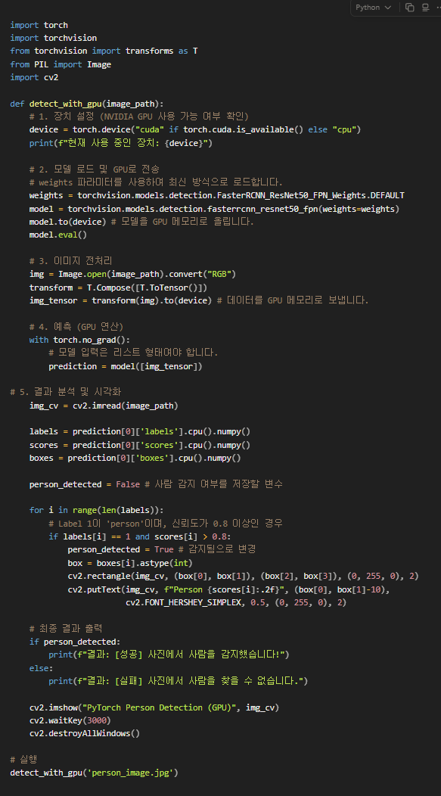

# AI 사람 인식 웹 애플리케이션 (AI Person Detector)

## 출발점



전에 만들어둔 코드를 웹으로 옮기는 작업을 했다.

##  프로젝트 구조

```
pytorch_face_web/
├── backend/               # Python FastAPI 백엔드
│   ├── main.py            # API 서버 및 엔드포인트
│   ├── detector.py        # PyTorch 사람 인식 로직
│   └── requirements.txt   # 백엔드 의존성 목록
├── frontend-react/        # React 프론트엔드
│   ├── src/               # React 소스 코드
│   ├── public/            # 정적 파일
│   └── package.json       # 프론트엔드 의존성 목록
├── requirements.txt       # 전체 프로젝트 의존성 (백엔드 기준)
└── README.md              # 프로젝트 설명서
```


---

##  사용 방법
1. 웹 브라우저에서 프론트엔드 주소(`http://localhost:5173`)로 접속합니다.
2. 화면 중앙의 드래그 앤 드롭 영역에 이미지를 끌어다 놓거나 클릭하여 선택합니다.
3. 잠시 기다리면 AI가 분석한 결과가 화면에 표시됩니다.
   - 사람 감지 성공: 초록색 박스로 사람이 표시되고, 몇 명인지 알려줍니다.
   - 사람 감지 실패: 사람이 없다는 메시지가 표시됩니다.

## 기술 스택
- Backend: Python, FastAPI, PyTorch (Torchvision), OpenCV
- Frontend: React, Vite, CSS (Glassmorphism Design)

---

